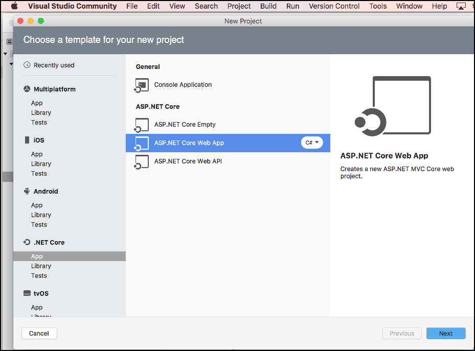
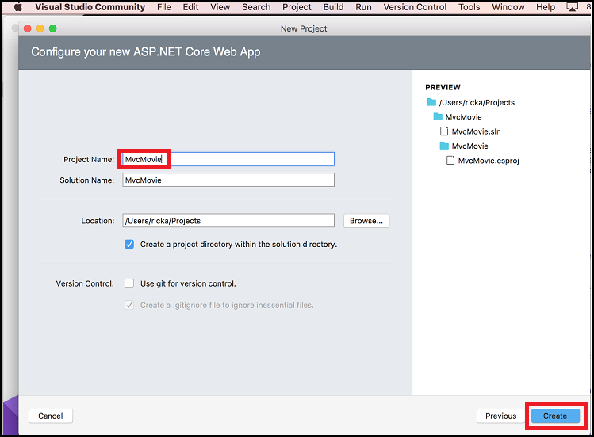
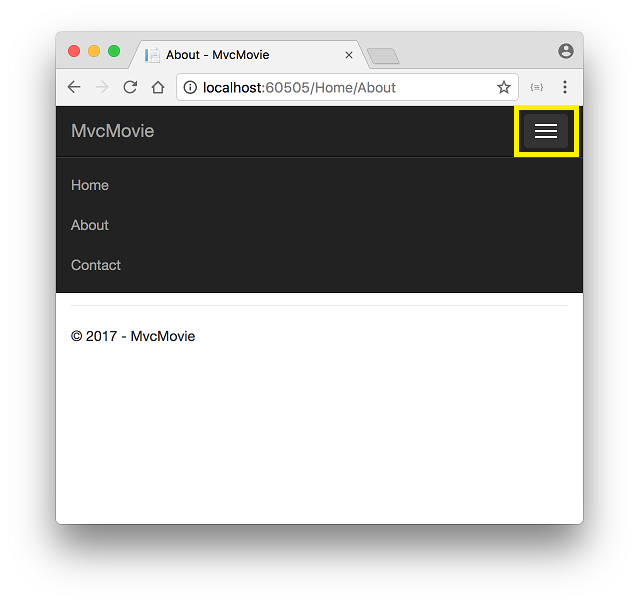

# Getting started with ASP.NET Core MVC and Visual Studio

By [Rick Anderson](https://twitter.com/RickAndMSFT)

This tutorial will teach you the basics of building an ASP.NET Core MVC web app using [Visual Studio for Mac](https://www.visualstudio.com/vs/visual-studio-mac/).

## Prerequisites

Install the following:

- [.NET Core SDK](https://www.microsoft.com/net/core#macos)  
- [Visual Studio for Mac](https://www.visualstudio.com/vs/visual-studio-mac/)

## Create a web app

From Visual Studio, select **File > New Solution**.

Select **.NET Core App >  ASP.NET Core Web App > Next**.

Name the project **MvcMovie**, and then select **Create**.

### Launch the app

In Visual Studio, select **Run > Start With Debugging** to launch the app. Visual Studio launches a browser and navigates to `http://localhost:port`, where *port* is a randomly chosen port number.

* Visual Studio starts [IIS Express](http://www.iis.net/learn/extensions/introduction-to-iis-express/iis-express-overview) and runs your app. Notice that the address bar shows `localhost:port#` and not something like `example.com`. That's because `localhost` is the standard hostname for your local computer. When Visual Studio creates a web project, a random port is used for the web server. In the image above, the port number is 5000. When you run the app, you'll see a different port number.
* You can launch the app in debug or non-debug mode from the **Run** menu.

The default template gives you **Home, About** and **Contact** links. The browser image above doesn't show these links. Depending on the size of your browser, you might need to click the navigation icon to show them.

In the next part of this tutorial, we'll learn about MVC and start writing some code.

>[!div class="step-by-step"]

[Next](adding-controller.md)  
